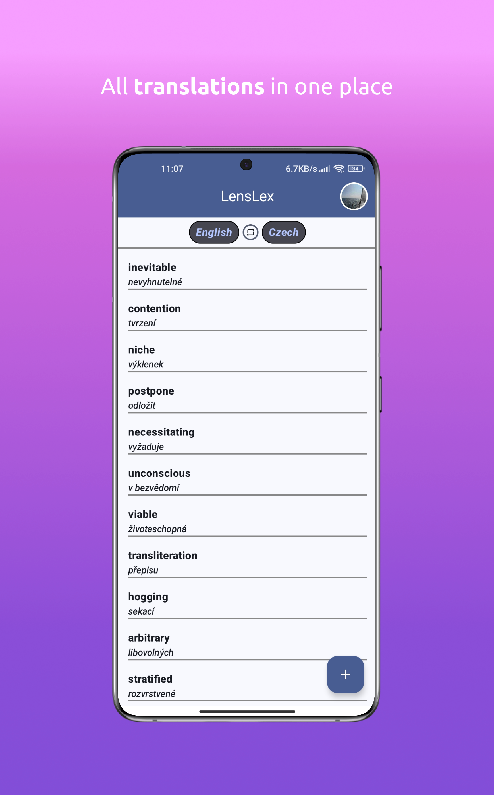
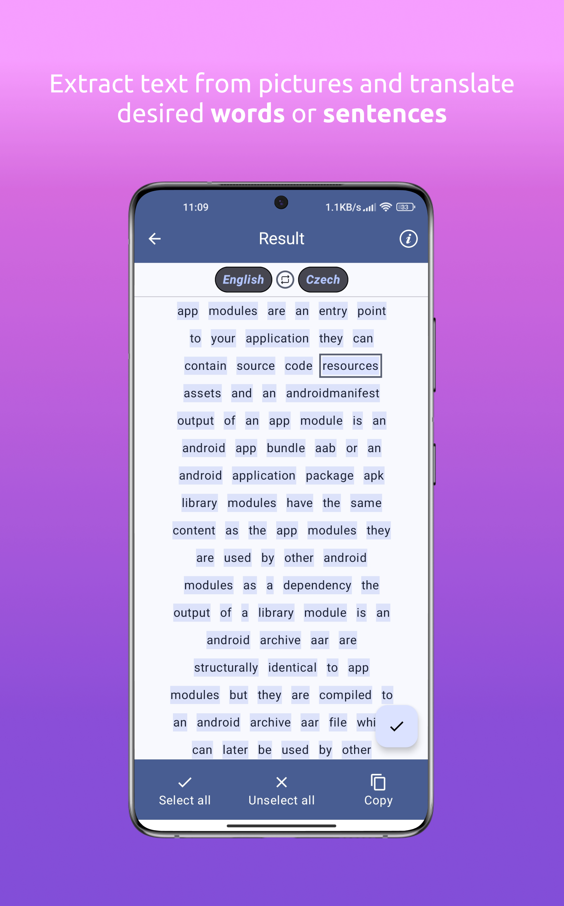

# LensLex

LensLex is an Android application designed to assist users in translating and storing words or sentences in supported foreign languages. Leveraging Google's ML Kit and Firebase, LensLex provides a seamless experience for language learners.

## Features

- **Cloud Storage**: All saved words and sentences are stored remotely in Firestore Database, making them accessible from any device with the corresponding account.
- **Adaptive layouts**
- **Text-to-speech**
- **Introshowcase**: User's introduction to non-trivial app features using compose introshowcase library by Canopas.
- **Offline Translations**: Using ML Kit from Google, translations are available even without an internet connection if the translation model for the specific language is downloaded.
- **OCR Support**: Users can take a photo or select an existing picture from the gallery, and LensLex will extract all the words. Users can then choose which words or sentences they want to translate and store in the chosen language.
- **Firebase Integration**: Full integration with Firebase.

## Screenshots
 

## Techstack & libraries
- **Kotlin**
- **MVI architecture**
- **Clean Architecture**
- **[Coroutines](https://developer.android.com/kotlin/coroutines)**
- **[Flow](https://developer.android.com/kotlin/flow)**
- **[Koin](https://insert-koin.io/docs/quickstart/android/)**
- **Jetpack DataStore**: Data storage solution from the Android Jetpack libraries.
- **Retrofit**: A type-safe HTTP client for Android and Java.
- **[Jetpack Compose](https://developer.android.com/develop/ui/compose)**: Declarative UI toolkit.
- **Firebase**
- **Credential Manager**

## Getting Started

These instructions will help you get a copy of the project up and running on your local machine for development and testing purposes.

### Prerequisites

- Android Studio
- A Firebase project set up for the app

### Installation

1. Clone the repository:
   ```sh
   git clone https://github.com/Mikailo01/LensLex.git
2. Open the project in Android Studio.
3. Add your google-services.json file to the project.
4. Sync the project with Gradle files.
5. Add your Firebase Web Api Key and Google Cloud Client ID for Credential Manager into local.properties file generated by Gradle. 
6. Run the app on an emulator or a physical device.
